# MuJoCo 기반 LLM Agent를 이용한 Panda-Omron 모바일 매니퓰레이터 제어 시스템

**반려로봇랩 시즌4:** 나호용, 박현아, 최경수, 현청천

---

## 반려로봇 랩 소개

### 시즌1 (2023.07 ~ 2023.12)
* **목표**: 실물 H/W와 ROS를 연동한 로봇 제어
* **구현**: Mapping, Navigation

### 시즌2 (2024.01 ~ 2024.06)
* **목표**: Unity와 ROS를 연동한 로봇 제어
* **구현**: Mapping, Planning & Navigation 등
* **데모**: [Youtube Link](https://www.youtube.com/watch?v=bMw6MsyI47c)

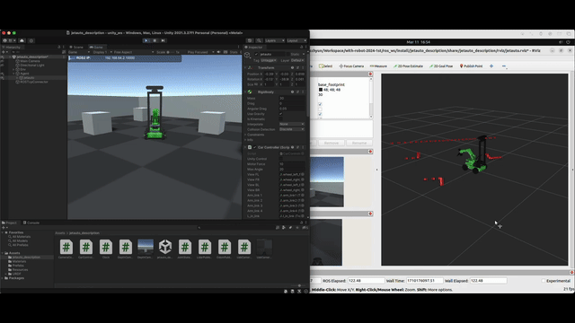

### 시즌3 (2024.07 ~ 2024.12)
* **목표**: 규칙기반으로 가정에서 간단한 임무를 수행하는 로봇 시뮬레이션 (CoppeliaSim)
* **구현**: Mapping, Planning & Navigation, Visual Servoing, Pick & Place 등
* **데모**: [Project Page](https://with-robot.github.io/with-robot-3rd/)

### 시즌4 (2025.01 ~ 2025.12)
* **목표**: 딥러닝 기반으로 가정에서 간단한 임무를 수행하는 로봇 시뮬레이션 (MuJoCo)
* **구현**: Planning & Navigation, Pick & Place 등 다양한 임무 수행
* **데모**: [Github Repository](https://github.com/with-robot/with-robot-4th)

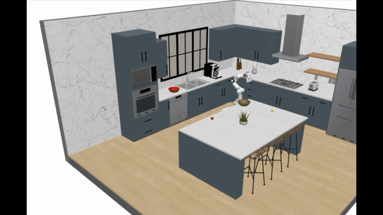

---

## 프로젝트 배경 및 목표

### 배경 (Background)
* **기존 제어의 한계:** 정해진 규칙 기반(Rule-based) 제어는 유연성이 낮음
* **지능형 로봇의 필요성:** 주방과 같은 비정형 환경에서 자율적인 판단 및 대처 능력이 요구됨

### 목표 (Objectives)
* **Simulation:** MuJoCo 기반 가상 환경 구축
* **Intelligence:** LLM Agent 기반 제어 코드 생성
* **Safety:** 샌드박스(Sandbox) 코드 실행 환경 구축
* **Connectivity:** REST API 기반 시스템 통합

---

## 시스템 아키텍처

* **User Interface (GUI):** HTML / Chat & Voice Interface (Web Speech API)
* **Intelligence Layer (LLM Agent):** Reasoning & Code Generation (LangGraph)
* **Service & Execution Layer:** Secure Sandbox (Python exec)
* **Control & Planning Layer:** Path Planning (A*), Kinematics (IK), PID
* **Physical Simulation Layer:** MuJoCo Physics Engine

---

## Physical Simulation Layer

* **Base Framework:** RoboCasa (Standalone XML)
* **Asset Source:** RoboCasa Assets ([Download](https://drive.google.com/file/d/1dIqsAECBx9uXw9jYwOAdIA01Eg2p4tEg/view?usp=drive_link))

### Implementation
* **Direct Loading:** `model/robocasa` ([Code](https://github.com/with-rl/with-robot-4th-lab/tree/main/model/robocasa))
* **Lightweight:** Executed directly via MuJoCo Python without full RoboCasa SDK
* **Custom Logic:** Simulator loop & controllers implemented `robot/simulator.py` ([Code](https://github.com/with-rl/with-robot-4th-lab/blob/main/robot/simulator.py))

### Robot Configuration
* **Manipulator:** Franka Emika Panda (7-DoF) ([참고](https://franka.de/))
* **Mobile Base:** Omron (3-DoF Wheels) ([참고](https://robotics.omron.com/))

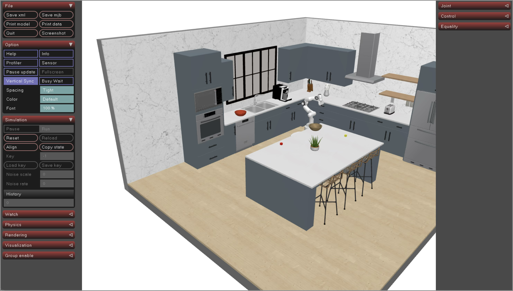

---

## Control & Planning Layer - 모바일

### Kinematics & Control Logic
* **Degrees of Freedom:** 3-DoF ($x, y, \theta$)
* **Algorithm:** PID Controller
* **Convergence Condition:** Position Error $<0.1m$, Velocity $<0.05m/s$

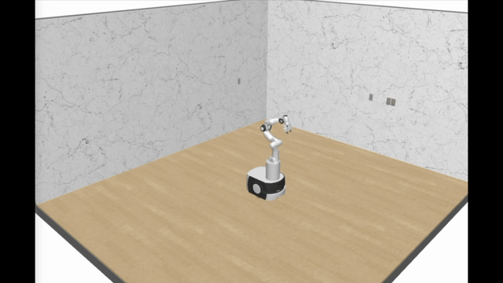

### Path Planning
* **Grid Map:** 0.1m Resolution
* **Obstacle Inflation:** Robot Radius 0.35m 고려
* **Core:** A* Algorithm
* **Optimization:**
    * Line-of-sight Check (직선화)
    * Angle Filtering (지터링 제거)
    * B-spline Smoothing (부드러운 주행)

| Optimization | Demo |
| :---: | :---: |
| 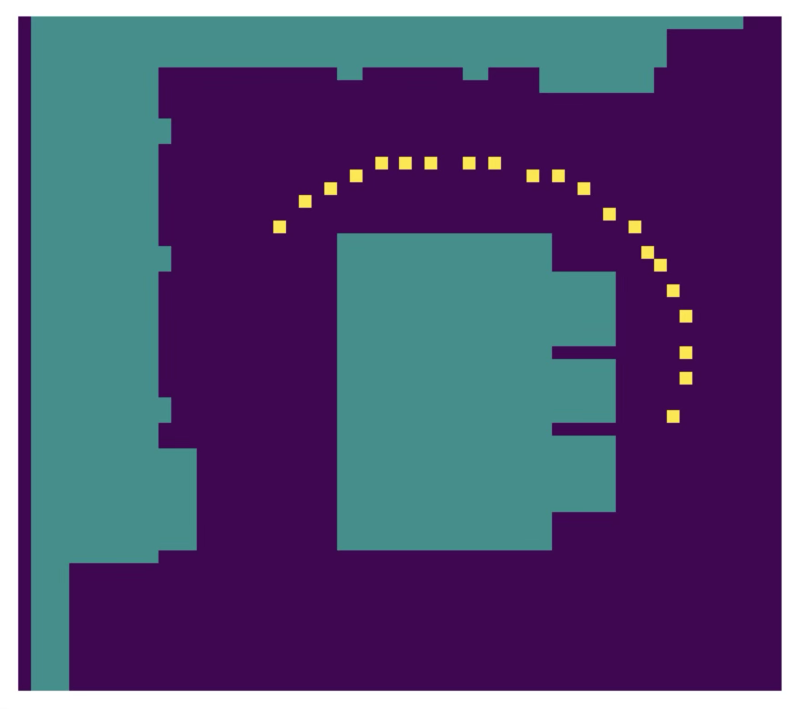 | 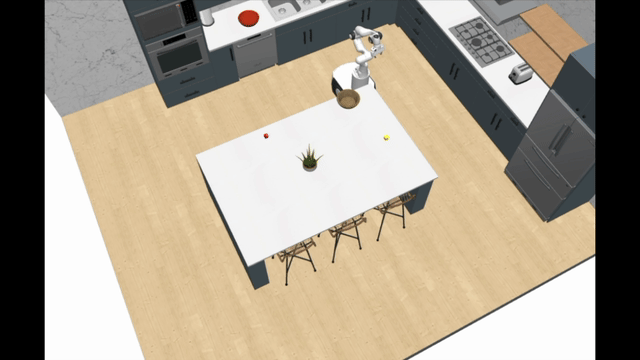 |

---

## Control & Planning Layer - 매니퓰레이터

### Control Methods (Dual Mode)
* **Joint Space:** Direct Angle Control (Home Pose)
* **Task Space:** Inverse Kinematics (Damped Least Squares)
* **Error:** Joint Position $<0.1$ rad, Velocity $<0.1$ rad/s

| Joint Space Control | Task Space Control |
| :---: | :---: |
| 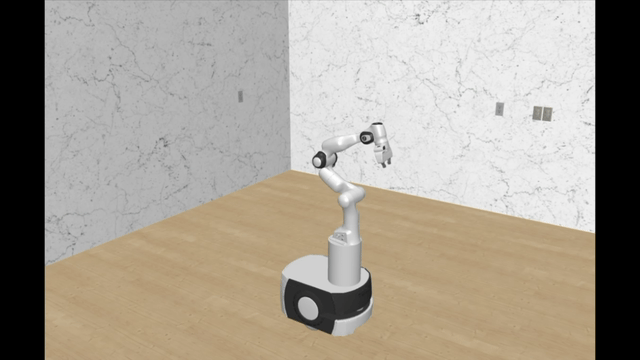 |  |

### Pick & Place
* **Pick:** Ready → Approach → Descend → Grasp (Wait 1.5s) → Lift → Base
* **Place:** Approach → Release (Wait 1.5s) → Retreat → Base

| Pick Action | Place Action |
| :---: | :---: |
| 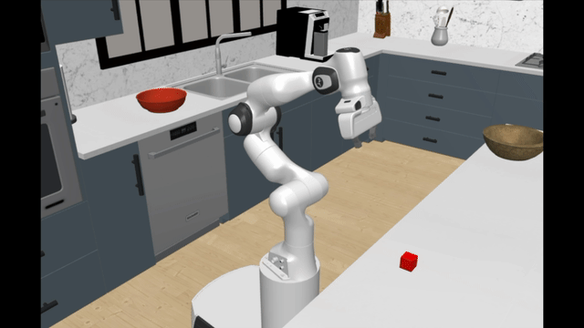 | 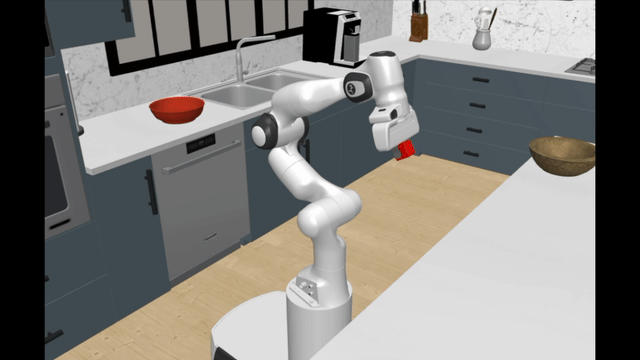 |

---

## Code Knowledge

* **code_knowledge.md** ([마크다운](https://github.com/with-rl/with-robot-4th-lab/blob/main/robot/code_knowledge.md))

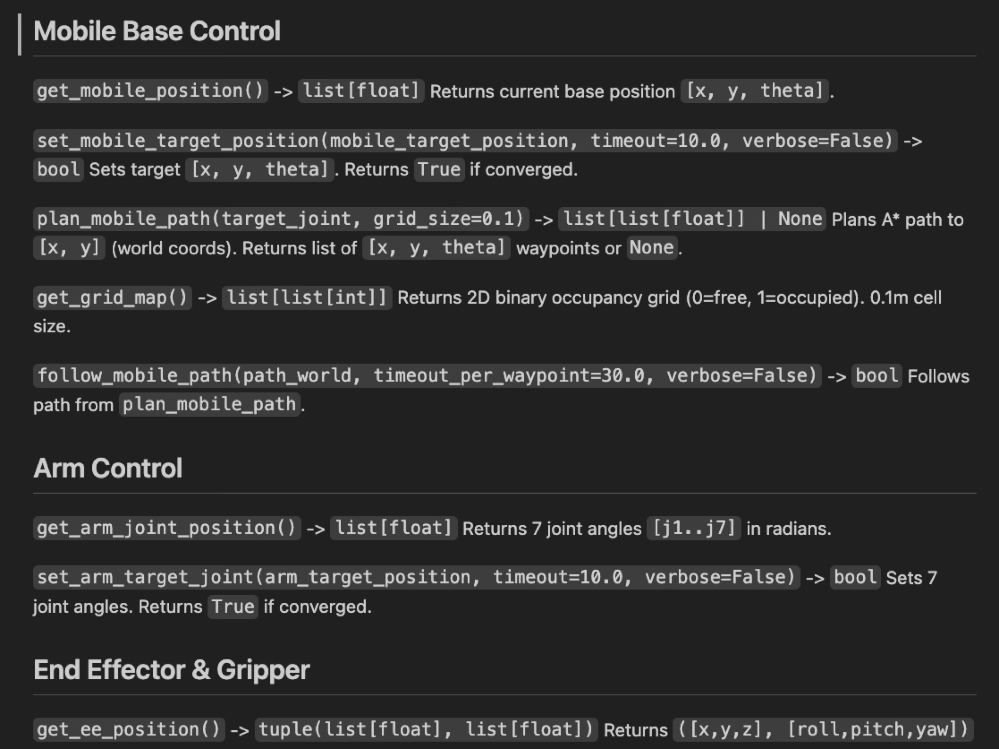

---

## Service & Execution Layer

### FastAPI Server Architecture
* **Multi-threading:** Simulator Loop + API Server
* **Endpoints:** `POST /send_action` (제어 코드 수신 및 실행)

### Secure Sandbox Environment
* **Policy:** `import` 금지, 파일/네트워크 접근 차단
* **Pre-loaded:** `math`, `time`, Robot Control APIs

### Feedback Loop
* **Flow:** Execution Result (JSON) → Agent Memory → Self-Correction (?)

---

## Intelligence Layer (LLM Agent)

### Robot Decomposition Planning Architecture
* **Framework:** LangChain + LangGraph
* **Core Role:** Natural Language → Robot Tasks (Python)
* **Flow:** Goal Decomposition → Task Decomposition → Executable Tasks

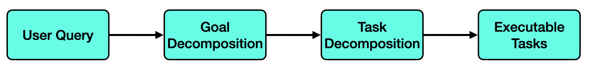

### State Definition & Executor
* **State Definition:** User Query, Object 정보, Robot Skill
* **Executor Flow:** Executable Tasks → Robot Simulator Commands → Execution

  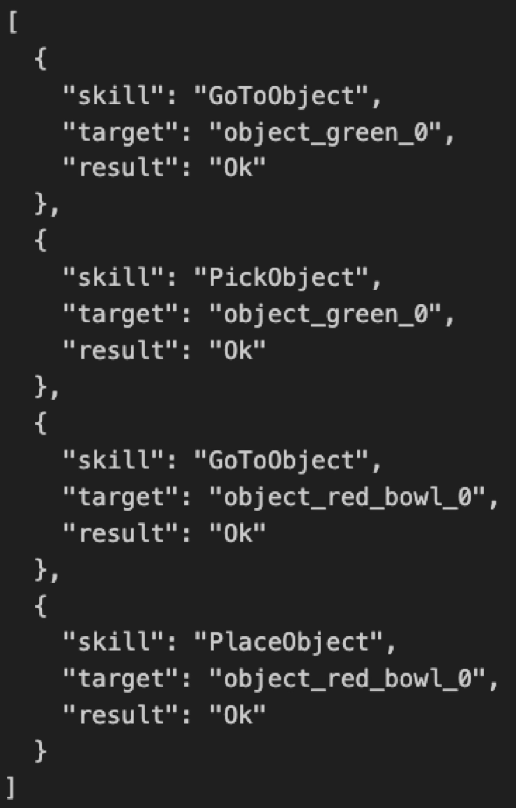

---

## 데모 시나리오

* **Process:** Perception → Task Planning → Pick & Place Loop
* **데모:** [Youtube Link](https://www.youtube.com/watch?v=nmREYIM-ZTM)

---

## 향후 계획: 시즌5 (2026.01 ~ 2026.06)

### Hardware Upgrade: Dual-Arm Robot
* **Target:** Sunday Robotics ([Neo](https://www.sunday.ai/technology))
* **Goal:** 양손 협업을 통한 복잡한 조작(Manipulation) 수행

  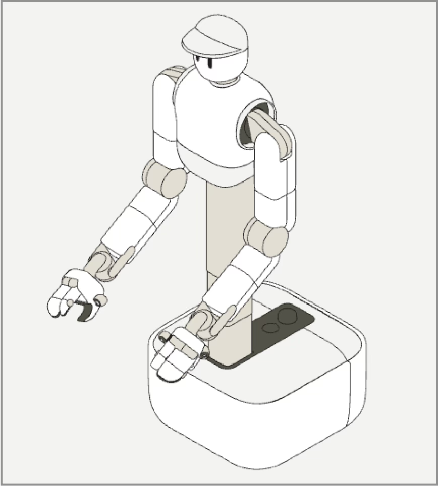

### Perception: Sensor-based Operation
* **Now:** 좌표(Coordinate) 기반 정적 수행
* **Future:** Vision/LiDAR 센서 기반 동적 상황 인지 및 임무 수행

### Deployment: Sim2Real (Mobile)
* **Goal:** Simulation 환경에서 학습/검증된 주행 알고리즘을 실제 모바일 로봇에 이식
* **Key:** Domain Randomization & Calibration
